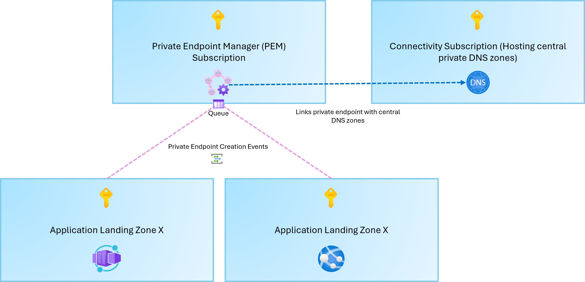

# Azure Private Endpoint Manager


Automated configuration of Azure Private Endpoints and Private DNS Zone linking for enterprise environments.

## Overview

Private Endpoint Manager is a solution designed to automate the configuration and DNS linking of Azure Private Endpoints to centralised Private DNS zones. It provides enterprise-grade flexibility, observability, and control over private endpoint deployments without the limitations of pure policy-based approaches.

### High-Level Architecture



## The Problem

### Central DNS Zones in Enterprise Environments

Many enterprise customers maintain central Private DNS zones in Azure to ensure consistent DNS resolution across their network. For example, resources like Storage Accounts require DNS zones such as `privatelink.blob.core.windows.net` to be properly resolved across the wider network infrastructure.

In complex enterprise environments, you may need to:
- Replicate DNS records to internal DNS solutions
- Integrate with private access technologies (Zscaler Private Access, Microsoft Entra Private Access)
- Maintain multiple DNS solutions for compliance or architecture reasons
- Track and audit DNS configuration changes

### Limitations of Azure Policy

While Azure Policy's **DeployIfNotExist** approach is a common solution, it has significant limitations:

#### Restrictiveness
- Policy-based DNS configuration can feel inflexible and may not provide all the capabilities your organization needs
- Adding new Azure resources quickly becomes cumbersome with strict policy constraints

#### Lack of Visibility
- Limited insight into automation outcomes (success/failure rates)
- Difficult to answer key enterprise questions:
  - How many private endpoints are being created daily?
  - What is the cost impact of DNS configuration?
  - Which subscriptions/resource groups are excluded and why?

#### Operational Challenges
- Difficult to filter subscriptions or resource groups selectively
- Troubleshooting and remediation can be time-consuming
- No built-in retry logic for transient Azure API failures
- Limited ability to handle dependent resource creation timing

## Why Private Endpoint Manager?

This solution provides:

### Flexibility
- **Custom logic** for DNS zone selection based on your specific requirements
- **Selective filtering** of subscriptions, resource groups, and resource types
- **Integration capabilities** with external DNS systems and private access technologies
- **Event-driven automation** using Azure Queue Storage for reliable processing

### Observability & Control
- **Detailed logging** of all operations for audit trails
- **Metrics and insights** on private endpoint creation rates and DNS configuration success
- **Retry logic** with exponential backoff for handling transient API failures
- **Cost tracking** capabilities through structured logging

### Scalability
- **PowerShell-based** functions for easy customization and extension
- **Modular architecture** for reusing logic across multiple scenarios
- **Queue-based processing** for handling high-volume events reliably

### Enterprise-Grade Features
- **Retry handling** for dependent resource creation timing
- **Tag-based state tracking** for auditing and compliance
- **Error handling and recovery** mechanisms
- **PowerShell 7 compatible** for modern cloud environments

## Architecture

### Components

```
c:\pemanager/
├── QueuePEManager/              # Azure Function for processing private endpoint events
│   └── run.ps1                  # Function entry point
├── QueueTrigger/                # Example trigger function
├── Modules/
│   └── PrivateEndpoint.Manager/ # Core PowerShell module
│       ├── PrivateEndpoint.Manager.psm1
│       └── PrivateEndpoint.Manager.psd1
├── config.json                  # DNS zone mappings configuration
└── requirements.psd1            # PowerShell dependencies
```

### Module Functions

The `PrivateEndpoint.Manager` module provides:

- **`Invoke-RetryableOperation`** - Executes operations with exponential backoff retry logic
- **`Parse-AzureResourceId`** - Extracts subscription, resource group, and resource name from Azure resource IDs
- **`Get-PrivateLinkGroupIds`** - Extracts group IDs from private link service connections
- **`Set-PrivateEndpointProvisionedTag`** - Updates private endpoint tags to track provisioning state
- **`Wait-PrivateEndpointProvisioning`** - Polls endpoint provisioning status with retry logic
- **`New-PrivateEndpointDnsZoneGroup`** - Creates DNS zone groups for private endpoints

## Configuration

### config.json

The solution uses a central configuration file to map private link service group IDs to private DNS zones:

```json
{
  "privateDnsZoneMappings": {
    "blob": {
      "zoneName": "privatelink.blob.core.windows.net",
      "resourceId": "/subscriptions/{subId}/resourceGroups/{rg}/providers/Microsoft.Network/privateDnsZones/privatelink.blob.core.windows.net"
    },
    "table": {
      "zoneName": "privatelink.table.core.windows.net",
      "resourceId": "/subscriptions/{subId}/resourceGroups/{rg}/providers/Microsoft.Network/privateDnsZones/privatelink.table.core.windows.net"
    }
  }
}
```

## Requirements

- **PowerShell 7.0+** (compatible with Azure Functions)
- **Azure PowerShell modules**: `Az.Network`, `Az.Accounts`
- **Azure resources**: Private DNS zones, Private Endpoints, Event Grid integration

## Integration with Azure Services

This solution integrates with:

- **Azure Event Grid** - Subscribes to private endpoint creation events
- **Azure Storage Queues** - Reliable event processing queue
- **Azure Functions** - Serverless execution environment
- **Azure Networking** - Private Endpoints and Private DNS zones

## Benefits Summary

| Aspect | Policy | Private Endpoint Manager |
|--------|--------|--------------------------|
| Flexibility | Limited | Highly customizable |
| Observability | Basic | Detailed logging & metrics |
| Error Handling | None | Retry logic with backoff |
| External Integration | Difficult | First-class support |
| Enterprise Filtering | Complex | Built-in |
| Troubleshooting | Time-consuming | Clear audit trail |
| Scalability | Policy-bound | Queue-based processing |

## Next Steps

1. Configure `config.json` with your private DNS zone mappings
2. Deploy the Azure Function to your environment
3. Set up Event Grid subscription to trigger on private endpoint creation
4. Monitor logs for successful DNS configuration

## License

[Specify your license here]

## Support

For issues, questions, or contributions, please [provide your support channel].
